# Documentation

The documentation for this years Hackathon must be provided as a readme in Markdown format as part of your submission. 

## Summary

**Category:** Sitecore Marketplace Website

This module provie the nessesary features to have a Marketplace Website. This features include the upload marketplace item and the download marketplace item. Also the download feature is like a Gated Download that you need first fill your personal information to get the download link.

The problem solved is how can dynamic upload the content without sitecore admin interface, and provide basic functionality of the marketplace. It is solve integrated with Sitecore Forms.

## Pre-requisites

- Nuget Packages:
    - Sitecore.Mvc
    - Sitecore.Mvc.Analytics
    - Constellation.Foundation.Mvc
    - Constellation.Foundation.Mvc.Patterns
    - Constellation.Foundation.Datasources
    - Constellation.Foundation.ModelMapping
- Sitecore Packages located at /App_Data/packages:
    - Constellation-Foundation-Datasources-Items.zip
    - Sitecore Forms Extensions For Sitecore 9.3-3.0.zip

## Installation

Provide detailed instructions on how to install the module, and include screenshots where necessary.

1. Use the Sitecore Installation wizard to install the [Marketplace Website Module-1.0.0.zip](https://github.com/Sitecore-Hackathon/2020-Just-me/blob/master/documentation/requirements/Marketplace%20Website%20Module-1.0.0.zip)
2. Deploy

## Configuration

### Create Upload Form if required

 N | Step | Image or Code Reference
--- | --- | ---
1 | Naviate to the homepage | 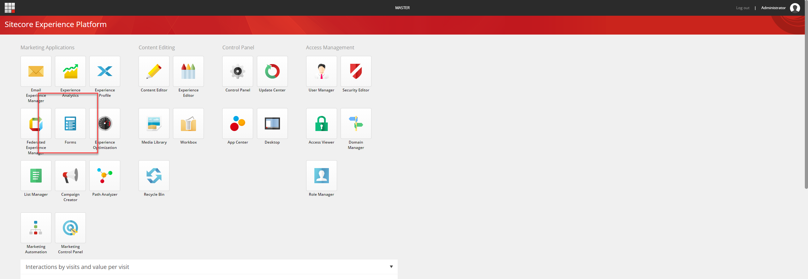
2 | Click on "Create Item" & Fill the form, then click on submit button | 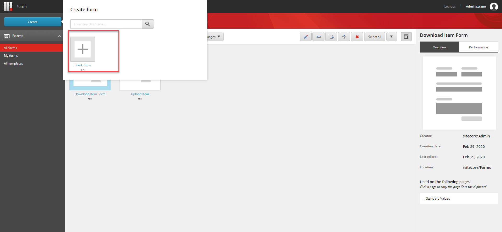
3 | Submit Button redirect to Homepage and you will see the new Item | 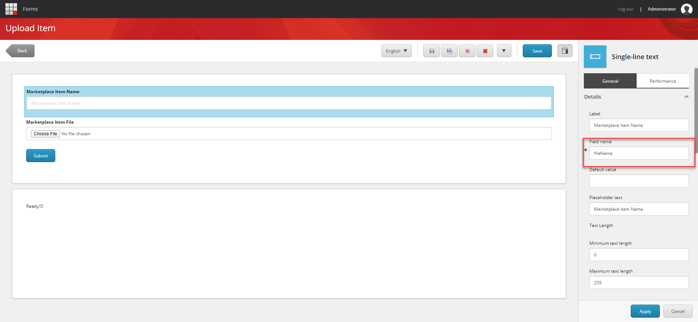
4 | You can check on Content Tree that Marketplace Item Page is already created | 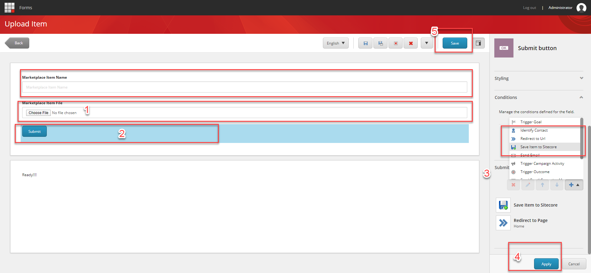
5 | Aslo you can check that Media Library Item is already created. | 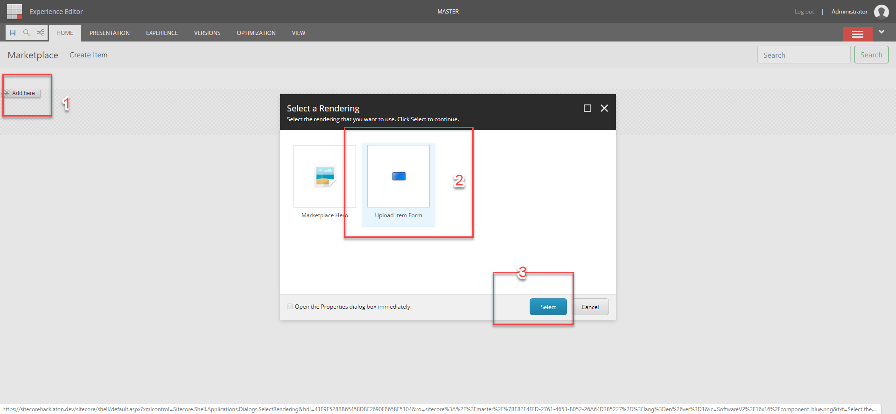
6 | On Homepage Click on a Marketplace Item, fill the form | 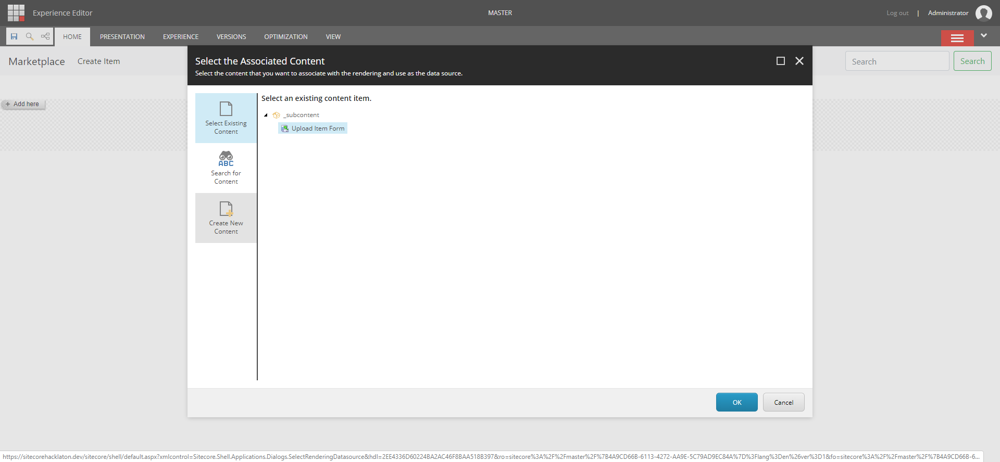
7 | Get the Download URL, Click on it | 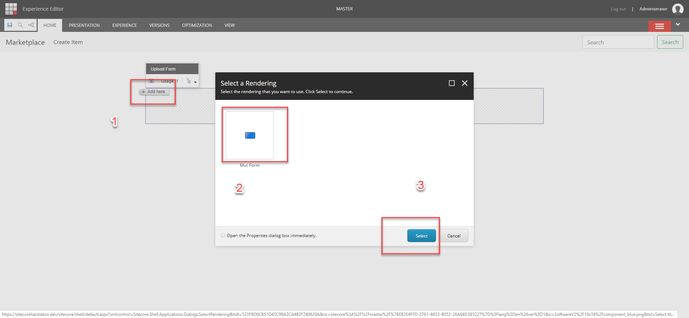
8 | The file is downloaded | 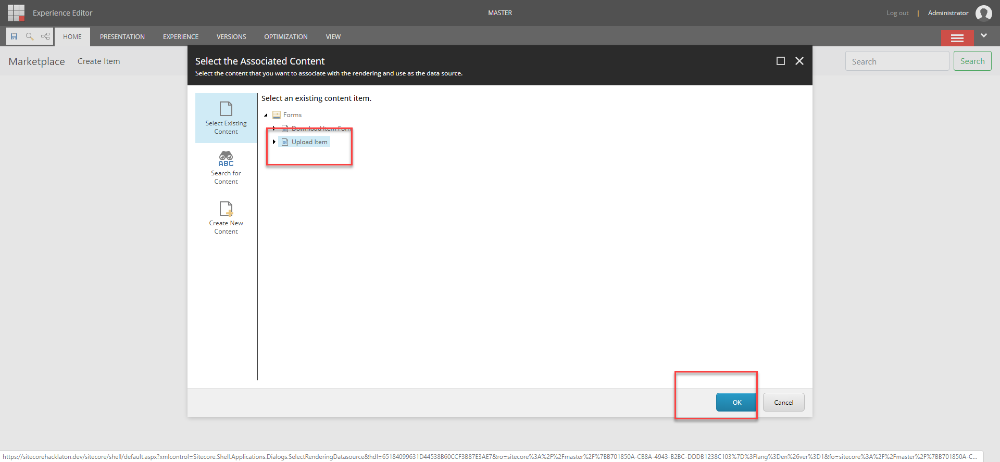

## Usage

### Create Upload Form

 N | Step | Image or Code Reference
--- | --- | ---
1 | On Launchpad click on Forms | 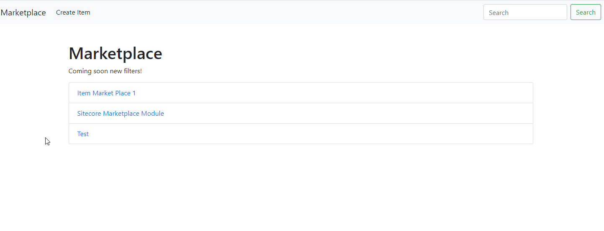
2 | Click on Create Blank Form | 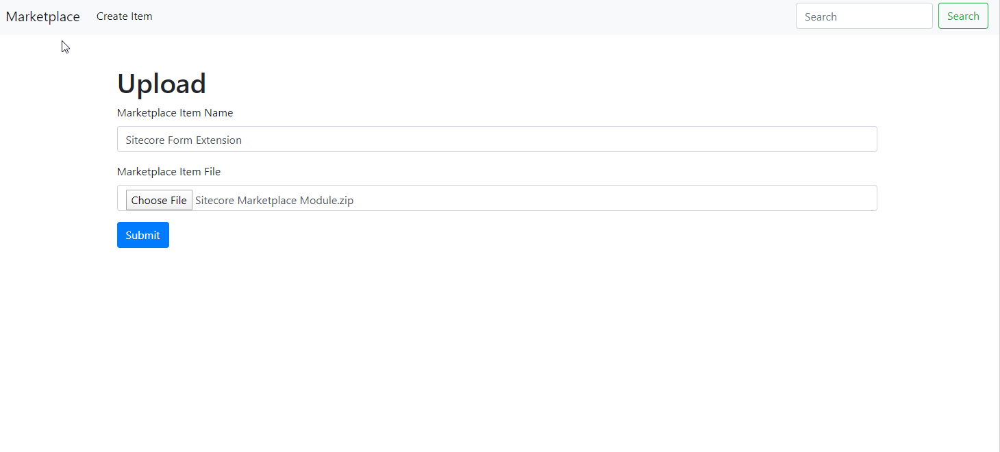
3 | Drag & Drop Single-line text and change Field Name by "fieldName" (mandatory) | 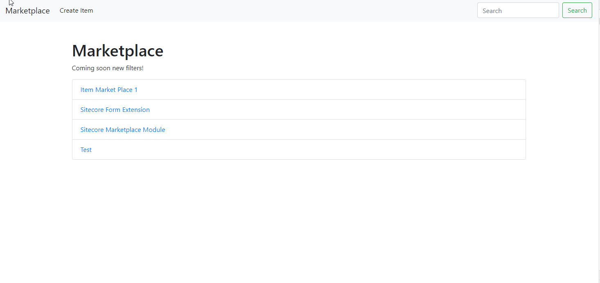
4 | 1. Add Upload Form Component 
2. Add Submit Button
3. Add Save Item to Sitecore | 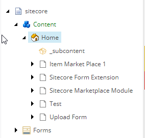
5 | 1. Add Upload Form Component on Page | 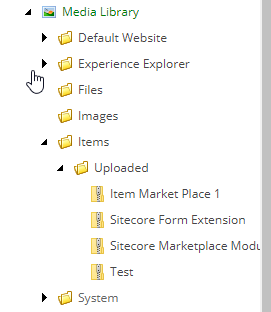
6 | Select datasource | 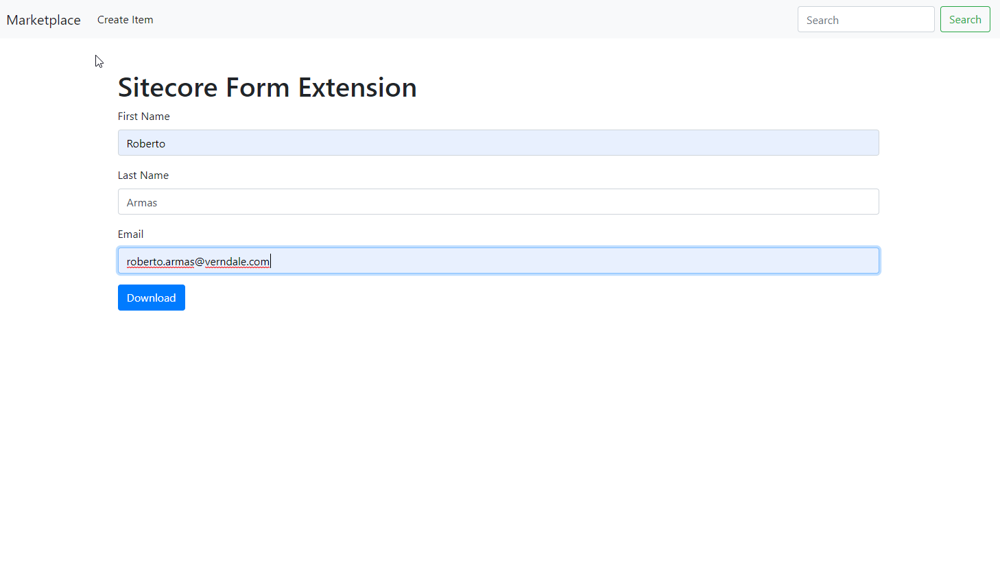
7 | Add MVC Form | 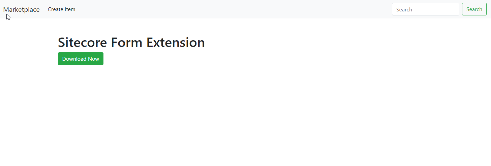
8 | Select "Upload Form" | 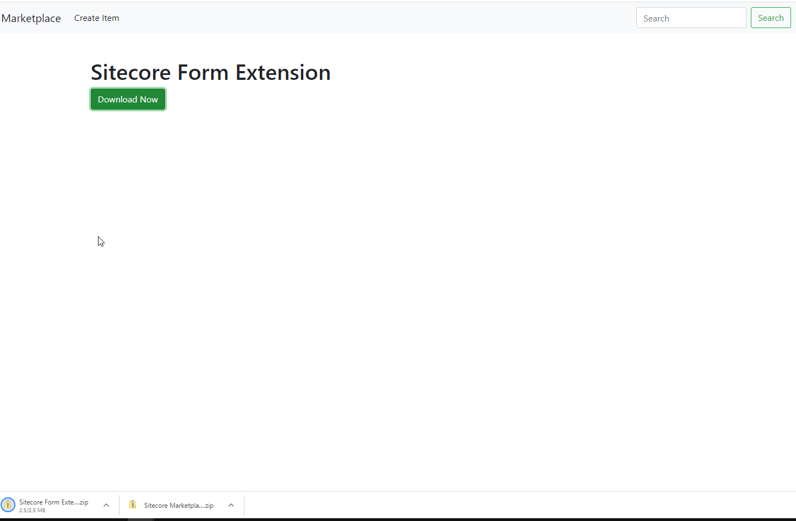

## Video

